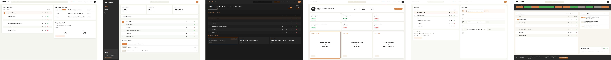

# Session: Lebowski Dashboard — "The League"
**Date**: 2026-04-01
**Tool**: Pencil (swarm mode, 6 agents)
**Page**: Fun exploration — bowling league management dashboard

---

## What we were designing

A bowling league management dashboard inspired by The Big Lebowski. Started with a 6-version concept brief (Bar & Bowl, Dude's Day, Gutterball Analytics, Case Board, The League, The Rug). Jan picked "The League" — the clean, product-like version — before seeing any designs, then asked for a 6-variation swarm prompt exploring different layout approaches within that direction.

---

## Concept brief (as written)

Single direction: "The League" — clean bowling league management app. Think Linear meets ESPN but for casual bowling. Same content across all 6, different layout/aesthetic per version:

- V1 "Clean Grid" — light, 3-column, amber accent
- V2 "Sidebar Nav" — dark sidebar, light main, app-shell feel
- V3 "Scoreboard" — full dark, LED-scoreboard energy, monospace
- V4 "Card-Heavy" — warm light, 2×3 team card grid, Notion-like
- V5 "Split Pane" — two equal panes, calendar timeline, productivity tool
- V6 "The Bowling Alley" — lane status strip hero, warm paper feel

---

## Screenshots

---

## The 6 versions

| # | Name | Spectrum | Jan's reaction |
|---|---|---|---|
| V1 | Clean Grid | Safe | 👍 Liked (part of "liked all") |
| V2 | Sidebar Nav | Considered | 👍 Liked (part of "liked all") |
| V3 | Scoreboard | Considered | 👍 Liked (part of "liked all") |
| V4 | Card-Heavy | Considered | 👍 Liked (part of "liked all") |
| V5 | Split Pane | Considered | 👍 Liked (part of "liked all") |
| V6 | The Bowling Alley | Spicy | 👍 Liked (part of "liked all") |

---

## Voice scoring results

| Version | Concept=Design | One idea | Dry>Loud | Real-world | Accent restraint | Neg. space | Not precious |
|---|---|---|---|---|---|---|---|
| V1 | ⚠️ Standard layout | ✅ | ✅ | ❌ Generic | ✅ | ✅ | ✅ |
| V2 | ⚠️ Standard layout | ✅ | ✅ | ❌ Generic | ✅ | ✅ | ✅ |
| V3 | ✅ Scoreboard frame | ✅ | ✅ | ✅ | ✅ | ⚠️ Dense | ✅ |
| V4 | ⚠️ Standard layout | ✅ | ✅ | ❌ Generic | ✅ | ✅ | ✅ |
| V5 | ⚠️ Standard layout | ✅ | ✅ | ❌ Generic | ✅ | ✅ | ✅ |
| V6 | ✅ Lane strip hero | ✅ | ✅ | ✅ Bowling alley | ✅ | ✅ | ✅ |

Note: This was a layout exploration within one product concept, not a conceptual-frame exploration like the pricing session. Most versions are intentionally "standard product UI" — the Lebowski flavour is in the data/content, not the format.

---

## What Jan said (verbatim)

- Overall: *"i liked all actually, good variability across those"*
- Iteration direction: *"maybe in the next iteration lets try to make some elements super prominent, like a very big number in our headline borna style (or jetbrains)"*

---

## Lessons extracted

### → `kvalt-design-voice.md`
- No new voice principles — this was a fun exploration, not a Kvalt page

### → `exploration-patterns.md`
- **Layout variation within a single concept works well.** When Jan picks one direction early, 6 layout approaches within that direction gives useful variety.
- **"Liked all" with a clear iteration note is a good signal.** The variability was right — not too similar, not too different.
- **Next iteration: push visual prominence.** Jan wants hero-sized numbers, Borna/JetBrains Mono at display scale. Current versions are too evenly weighted — need a dominant visual element.

### → `style-guide-tags.md`
- No new tag data — this session used direct style descriptions, not Pencil style guide tags

### → `concept-library.md`
- No new concepts tested — all 6 were layout variations of "clean product dashboard"

---

## Next steps

Iteration round 2: same content, but push visual hierarchy harder:
- Hero-sized stat numbers (Borna Bold or JetBrains Mono at 60-80px+)
- One dominant metric per version that commands the layout
- More contrast between the "big thing" and supporting data
